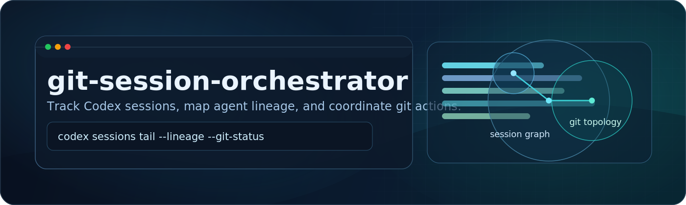

<p align="center">
  
</p>

<p align="center">
  <a href="https://github.com/KyleJKistner/git-session-orchestrator-skill"></a>
  
  
</p>

# git-session-orchestrator

`git-session-orchestrator` is a Codex skill for monitoring session activity (including subagents) and coordinating safe git operations from current repository state.

Repo: `https://github.com/KyleJKistner/git-session-orchestrator-skill`

## Why This Skill

| Capability | What you get |
| --- | --- |
| Session visibility | Inventory of primary/subagent sessions, lineage, activity, and log paths |
| Git coordination | Branch divergence, dirty worktrees, and ordered next-command guidance |
| Live heartbeat | Continuous delta stream for both session state and git topology |
| Safer operations | Guardrails against destructive or out-of-order git coordination |

## Install in 30 Seconds

```bash
git clone https://github.com/KyleJKistner/git-session-orchestrator-skill.git
cd git-session-orchestrator-skill
./install.sh
```

Update an existing local clone:

```bash
cd git-session-orchestrator-skill
git pull
./install.sh --force
```

## Verify

```bash
ls ~/.codex/skills/git-session-orchestrator
```

Expected:
- `SKILL.md`
- `agents/`
- `references/`
- `scripts/`

## Installer UX

The installer includes:
- sectioned output with clean status markers
- interactive overwrite confirmation
- `--dry-run` preview mode
- `--force` non-interactive replacement
- post-copy file verification

Flags:

```bash
./install.sh --help
./install.sh --dry-run
./install.sh --force
```

## Command Quickstart

Session inventory:

```bash
python3 ~/.codex/skills/git-session-orchestrator/scripts/session_monitor.py inventory --project-root "$PWD" --recent 20 --active-minutes 30
```

Recent activity summary:

```bash
python3 ~/.codex/skills/git-session-orchestrator/scripts/session_monitor.py activity --project-root "$PWD" --recent 10
```

Git topology snapshot:

```bash
python3 ~/.codex/skills/git-session-orchestrator/scripts/git_coordination.py --repo-root "$PWD" --main-branch auto
```

Continuous heartbeat stream:

```bash
python3 ~/.codex/skills/git-session-orchestrator/scripts/heartbeat_monitor.py --project-root "$PWD" --repo-root "$PWD" --active-minutes 30 --poll-interval 5 --heartbeat-interval 20
```

One heartbeat cycle:

```bash
python3 ~/.codex/skills/git-session-orchestrator/scripts/heartbeat_monitor.py --project-root "$PWD" --repo-root "$PWD" --once
```

## Local Skill Path

Installed target path:

```bash
~/.codex/skills/git-session-orchestrator
```
